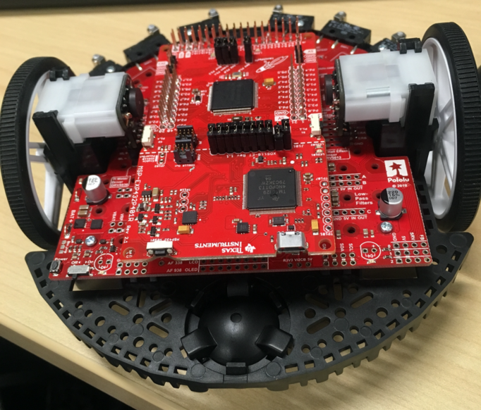
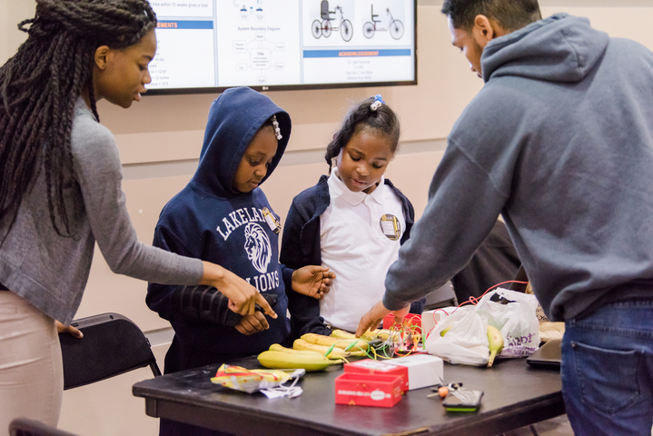

---

title: Personalized Learning Experiences
date: 2019-12-18
tag:
tags:

---
<h1 style="color: gold">Interdisciplinarity</h1>

I have a minor in Information Systems. The courses I have taken have a lot to do with management, business and analyzing a software system. This is important for personalized learning because when creating technology that focuses on personalizing learning, it is important to understand how the system currently works, finding the issues, and developing potential solutions. Through IS, I also learned that solutions are not “one-size fits-all”.

<h1 style="color: gold">Research</h1>

I have conducted research in the Prototype and Design (PAD) Lab (now DARE lab) for 1.5 years. This is where I learned about assistive technology. In graduate school, I want to make personalize learning in technology by integrating accessibility through sound and haptics. May consider working with Dr. Ben Johnson on computer science education research using board games to teach data structures.

[Click here to for more details on my work in the PAD Lab ](https://www.fayoojo.com/project/sensebox/)

<h1 style="color: gold">Entrepreneurship</h1>
I developed software at two, twelve-week internships at Texas Instruments. During my IT internship, I built a webpage that improved managers’ ability to track employee assignments. The following summer I was in Embedded Processing and I built a robot, TI RSLK MAX. My major project involved me creating software that automated testing when changes were detected.

<h1 style="color: #cd7f32">Global</h1>
TBD – Either German 100 or Music of the World. I applied for the Fulbright Research Abroad in Germany, and I plan to collaborate with people all around the world as a graduate student and beyond.

<h1 style="color: gold">Service</h1>
I have completed over 100 hours of service as a leader in Computer Science Education. This has included partnerships with Lakeland Elementary/Middle School, Lansdowne High School, and North County High School. This also includes organizing [Hour of Code events at UMBC.](https://www.csee.umbc.edu/2019/01/hour-of-code-brings-baltimore-3rd-and-4th-graders-to-umbc-for-fun-intro-to-computing/)

